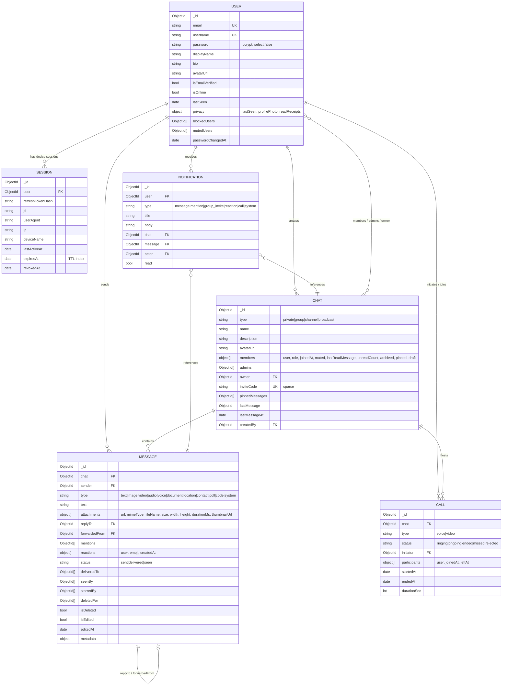

# Architecture

This document describes the architecture of the Realtime Chat platform: the layered
backend design, the request lifecycle, the realtime (Socket.IO) flow, the horizontal
scaling model, and the authentication / token-rotation design.

---

## 1. High-level overview

The system is a classic client / API / datastore split, with a dedicated realtime
channel (Socket.IO) running alongside the HTTP API inside the same Node process. Both
the HTTP layer and the socket layer are stateless with respect to each other — they
communicate only through the database and through a shared **socket emitter** abstraction,
which keeps business logic decoupled from transport.

```
                                   ┌─────────────────────────────┐
                                   │          Clients            │
                                   │  React 18 + Vite SPA (web)   │
                                   │  socket.io-client + REST     │
                                   └──────────────┬──────────────┘
                                                  │  HTTP + WebSocket
                                                  ▼
                                   ┌─────────────────────────────┐
                                   │   Nginx reverse proxy        │
                                   │   :8080  (ip_hash sticky)    │
                                   │   /api → api   / → web        │
                                   └──────────────┬──────────────┘
                        ┌─────────────────────────┼─────────────────────────┐
                        ▼                          ▼                         ▼
              ┌──────────────────┐      ┌──────────────────┐      ┌──────────────────┐
              │  api replica #1  │      │  api replica #2  │      │  api replica #N  │
              │ Express + Socket │ ...  │ Express + Socket │ ...  │ Express + Socket │
              │ PM2 cluster mode │      │ PM2 cluster mode │      │ PM2 cluster mode │
              └───────┬──────────┘      └────────┬─────────┘      └────────┬─────────┘
                      │                          │                         │
                      └───────────┬──────────────┴────────────┬───────────┘
                                  ▼                            ▼
                        ┌──────────────────┐        ┌──────────────────┐
                        │      Redis       │        │     MongoDB      │
                        │ Socket.IO adapter│        │  Mongoose models │
                        │ presence + rate  │        │  (primary store) │
                        │ limit + pub/sub  │        │                  │
                        └──────────────────┘        └──────────────────┘
```

Redis is the glue that makes multiple API replicas behave as one logical server: the
Socket.IO Redis adapter fans out room broadcasts across replicas, presence sets live in
Redis, and the distributed rate limiter shares its counters there too.

---

## 2. Layered backend architecture

The backend follows a strict, one-directional layering. Each layer only depends on the
layer directly beneath it. This keeps controllers thin, business logic testable, and
data access reusable.

```
 HTTP request
      │
      ▼
 ┌──────────────┐   URL + method matching
 │   Route      │
 └──────┬───────┘
        ▼
 ┌──────────────┐   Zod schema parse of body / query / params
 │ validate()   │   (rejects with BAD_REQUEST on failure)
 │ middleware   │
 └──────┬───────┘
        ▼
 ┌──────────────┐   HTTP concerns only: reads req, shapes the
 │  Controller  │   JSON envelope, sets status codes
 └──────┬───────┘
        ▼
 ┌──────────────┐   Business logic, authorization rules,
 │   Service    │   orchestration, realtime.* broadcasts
 └──────┬───────┘
        ▼
 ┌──────────────┐   Data access, extends BaseRepository
 │  Repository  │   (generic CRUD, pagination, lean queries)
 └──────┬───────┘
        ▼
 ┌──────────────┐   Mongoose schema, indexes, hooks
 │    Model     │
 └──────────────┘
```

| Layer | Responsibility | Must NOT do |
|-------|----------------|-------------|
| **Route** | Bind method + path to a validator and controller | Contain logic |
| **validate() middleware** | Parse & coerce input with Zod; attach typed values | Touch the DB |
| **Controller** | Translate HTTP ↔ service calls; build response envelope | Contain business rules |
| **Service** | Enforce business rules & authorization; emit realtime events | Read `req`/`res` directly |
| **Repository** | Encapsulate Mongoose queries; extends `BaseRepository` | Contain business rules |
| **Model** | Define schema, indexes, and document-level hooks | Cross-collection orchestration |

`BaseRepository<T>` provides the common data-access surface (create, findById,
findOne, find with pagination, updateById, deleteById, lean reads) so concrete
repositories (`UserRepository`, `ChatRepository`, `MessageRepository`, …) only add the
queries specific to their aggregate.

---

## 3. Request lifecycle (HTTP)

A representative write path — `POST /api/v1/chats/:id/messages`:

1. **Global middleware** runs first: `helmet` (security headers), `cors`,
   `compression`, `express-mongo-sanitize` (strips `$`/`.` operators from input),
   `express-rate-limit` backed by `rate-limit-redis`, request logging via `pino`.
2. **Auth middleware** verifies the JWT access token from the `Authorization: Bearer`
   header (or `accessToken` cookie), loads the user, and rejects with `UNAUTHORIZED`
   if invalid/expired.
3. **Route** matches and dispatches to `validate(schema)`.
4. **validate()** parses `params`, `query`, and `body` against a Zod schema. Failure →
   `400 BAD_REQUEST` with a `details` array.
5. **Controller** extracts typed inputs and calls the service.
6. **Service** authorizes (is the caller a member of the chat?), persists the message
   through the repository, updates `chat.lastMessage`/`lastMessageAt` and unread
   counters, then broadcasts via `realtime.messageCreated(...)`.
7. **Repository → Model** performs the Mongoose write.
8. **Controller** returns `{ success: true, data }`, which the response formatter
   serializes.
9. **Realtime fan-out** happens independently of the HTTP response: connected members
   receive `receive-message` in room `chat:<id>` (across all replicas via the Redis
   adapter).

Errors bubble to a central error handler that maps known error classes to the standard
envelope `{ success: false, error: { code, message, details } }`.

---

## 4. Realtime flow (Socket.IO)

The realtime layer is deliberately decoupled from HTTP. Services never call
`io.emit(...)` directly; they call helpers on a **socket emitter** module (the
`realtime.*` helpers). At startup the emitter is bound to the live `io` instance. This
means:

- Business logic in services is transport-agnostic and unit-testable (the emitter can
  be mocked).
- Both an HTTP controller and a socket handler can trigger the same broadcast without
  duplicating logic.

**Connection & auth.** A client connects with the access token in the handshake
(`auth.token`) or via the `accessToken` cookie. A connection middleware verifies the
token, attaches the user, and joins the socket to its **personal room** `user:<id>`.

**Rooms.**

| Room | Purpose |
|------|---------|
| `user:<id>` | Per-user room. Every socket a user opens (multi-tab / multi-device) joins it. Used for notifications, presence, `user-updated`, call signaling. |
| `chat:<id>` | Per-conversation room. Joined on `join-chat`, left on `leave-chat`. Used for messages, typing, reactions, seen receipts. |

**Presence.** Presence is tracked in Redis as a **per-user set of socket ids**. On
connect, the socket id is added to the user's set; on disconnect it is removed. A user is
"online" while their set is non-empty — this makes presence **multi-tab / multi-device
safe** (closing one tab does not mark you offline). When the set empties, the server
persists `lastSeen` and broadcasts `offline`.

**Broadcast fan-out.** Because rooms may contain sockets connected to different API
replicas, the **Socket.IO Redis adapter** publishes room emits over Redis pub/sub so
every replica delivers to its local members. From the service's point of view it is a
single `realtime.*` call.

**Acks.** Latency-sensitive or result-bearing events use acknowledgement callbacks —
e.g. `send-message(payload, ack)` returns the persisted message, `call-start(...)`
returns `{ callId }`, and `presence-state(userIds[], ack)` returns the online subset.

---

## 5. Scaling model

The application scales **horizontally** by running multiple API replicas, all sharing
Redis and MongoDB. Three mechanisms make this work:

1. **PM2 cluster mode.** Inside each container/host, PM2 forks one Node worker per CPU
   core (`PM2_INSTANCES`), load-balancing connections across the cluster. All workers of
   a replica share the same code and connect to the same Redis/Mongo.

2. **Socket.IO Redis adapter.** Room membership is local to each worker, but the Redis
   adapter propagates `to(room).emit(...)` across every worker and every replica via
   pub/sub, so a broadcast reaches all members regardless of which process they are
   connected to.

3. **Nginx `ip_hash` sticky sessions.** WebSocket upgrade requires a client to stay
   pinned to the same upstream for the life of the connection. Nginx uses `ip_hash` so a
   given client consistently lands on the same API replica, while still spreading
   different clients across replicas. (The Redis adapter still handles cross-replica
   fan-out; stickiness is about the long-lived socket, not about correctness of
   broadcasts.)

Shared state that must be global lives in Redis (presence sets, rate-limit counters,
pub/sub) or MongoDB (all persistent data). Nothing durable is kept in per-process memory,
so replicas are interchangeable and can be added or removed freely.

---

## 6. Authentication & token-rotation design

Auth uses a **short-lived access token** plus a **rotating, hashed refresh token**, with
device-level session tracking.

- **Access token** — JWT, `~15m` TTL (`JWT_ACCESS_TTL`). Sent as a Bearer header or
  `accessToken` cookie. Stateless: verified by signature, no DB lookup required for the
  common path. Passwords carry `passwordChangedAt` so tokens issued before a password
  change can be rejected.

- **Refresh token** — long-lived (`JWT_REFRESH_TTL`, default 30d), **rotating**. The raw
  token is never stored; only its hash (`refreshTokenHash`) is persisted inside a
  **Session** document along with a `jti`, `userAgent`, `ip`, and `deviceName`.

- **Rotation & reuse detection.** On `POST /auth/refresh`, the presented refresh token is
  hashed and matched against the session. A new access + refresh pair is issued and the
  session's stored hash is rotated. If a **previously used (already rotated) refresh
  token** is presented — a signal of theft/replay — **reuse detection revokes the
  session** (sets `revokedAt`), forcing re-authentication.

- **Sessions = device sessions.** Each login creates a Session. Users can list active
  sessions (`GET /users/sessions`) and revoke a specific one
  (`DELETE /users/sessions/:sessionId`). `POST /auth/logout` revokes the current
  session; `POST /auth/logout-all` revokes **every** session for the user.

- **Expiry.** The Session's `expiresAt` field has a **MongoDB TTL index**, so expired
  sessions are reaped automatically.

```
 login ──▶ issue access(15m) + refresh(30d)     ──▶ store Session{ hash, jti, device }
   │
   ├─ request with access token ──▶ verify signature ──▶ allow
   │
   └─ access expired ──▶ POST /auth/refresh(refresh)
                             │
                             ├─ hash matches current session hash ──▶ rotate ──▶ new pair
                             └─ hash matches an OLD/used token   ──▶ REUSE! ──▶ revoke session
```

---

## 7. Entity–relationship diagram



### Key indexes

| Collection | Indexes |
|------------|---------|
| User | unique `email`, unique `username`, text(`username`,`displayName`), (`isOnline`,`lastSeen`) |
| Session | `expiresAt` (TTL) |
| Chat | (`members.user`, `lastMessageAt`) |
| Message | (`chat`,`createdAt`), text(`text`), `starredBy` |
| Notification | (`user`,`read`,`createdAt`) |
| Call | (`participants.user`,`createdAt`) |
